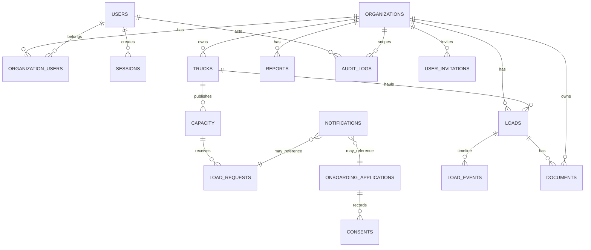

# E. Data model / ERD

The canonical schema is `apps/api/sql/001_init.sql`; `002_seed_demo.sql` is explicitly DEMO-only and public capacity excludes demo records unless a non-production flag is enabled.
